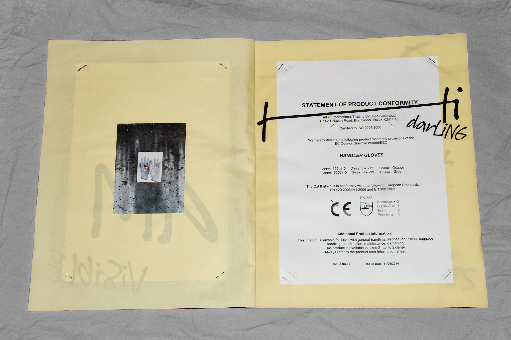
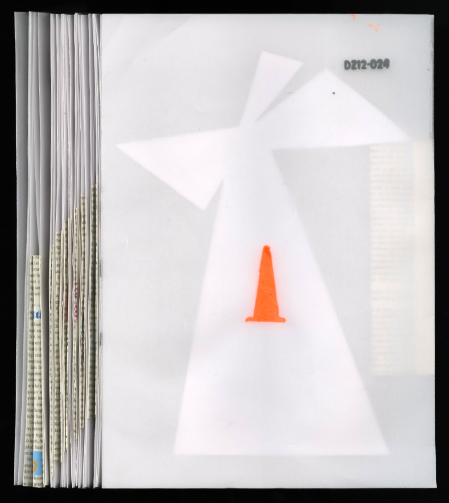
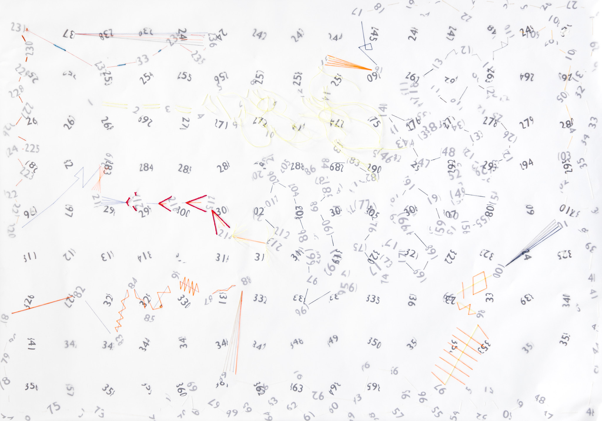

<!DOCTYPE html>
  <head>
    <meta charset="utf-8">
    <meta name="viewport" content="width=device-width,initial-scale=1.0">
    <title>Sabo Day</title>

    <link href="https://cdnjs.cloudflare.com/ajax/libs/magnific-popup.js/1.1.0/magnific-popup.css" rel="stylesheet">

    <!-- <link rel="shortcut icon" type="image/x-icon" href="http://saboday.com/favicon.ico"> -->
  </head>
  
  <body>
    <header>
      Sabo Day  
      profile and contact
    </header>
    

    

    <main>

          

          
        

         

          
        

         

          
        

         

          
        

         

          
        

         

          
        

         

          
        

         

          
        

         

          
        

        

</main>
<footer>

</body>
</html>

